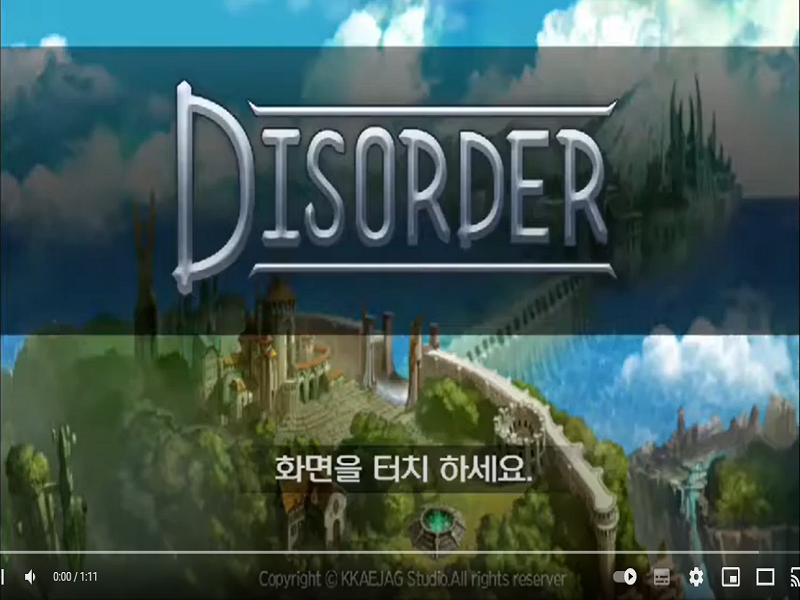

## 프로젝트 개요

* **프로젝트명:** Unity mobile 턴제 게임
* **제작기간:** 약 4개월
* **플랫폼:** 모바일
* **언어:** C#
* **장르:** 턴제 전투 게임
* **엔진,툴:** Unity Engine, NGUI

## 프로젝트 설명 

* 시연 영상
https://www.youtube.com/watch?v=emlvyKS1YS0&ab_channel=JanghoNa

## 구현기능
* 
* 
* 
* 
* 

## 아쉬운점 및 한계점
